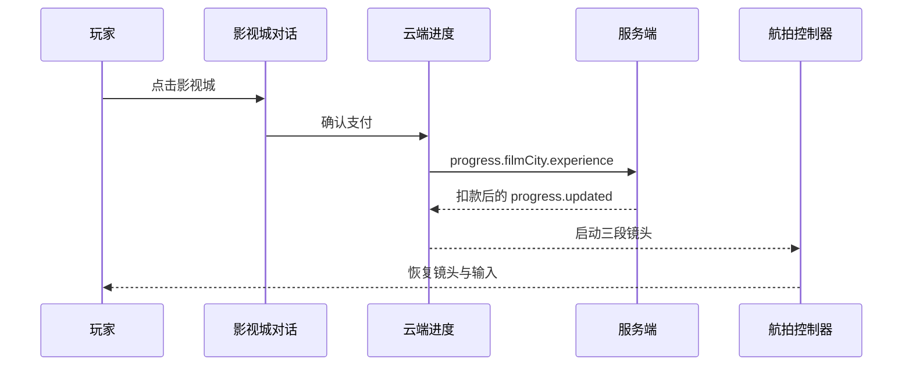

# 影视城飞跃地平线技术设计

Feature Name: film-city-flyover
Updated: 2026-08-19

## Description

本功能在既有正式建筑、云端进度和 GSAP 摄像机控制链路上增加影视城及一次性服务消费。影视城主体使用正式建筑实体参与标签、射线与碰撞，入口视觉延伸至第二处清场地块。

## Architecture



## Components And Interfaces

- `cityConfig.ts` 定义影视城清场坐标，住宅生成器使用统一判断函数跳过两处地块。
- `buildingMeshFactory.ts` 创建影视城主体、片场招牌、首映前场和入口设施。
- `filmCityExperienceController.ts` 管理确认、付款、30 秒镜头计划、运行状态和恢复。
- `cloudProgressionController.ts` 将服务端成功事件转换为付款 Promise 结果。
- 服务端 `progress.filmCity.experience` 分支使用固定价格调用数据库原子扣款。

## Data Models

```ts
type FilmCityShot = {
  phase: 'wide' | 'near' | 'closeup';
  x: number;
  z: number;
  zoom: number;
  duration: number;
};
```

## Correctness Properties

- 两处清场坐标均不会生成住宅。
- 体验价格由服务端常量确定，客户端无法指定价格。
- 数据库仅在余额满足价格条件时完成扣款。
- 单次航拍的三个镜头总时长为 30 秒。
- 航拍的完成路径和中断路径均恢复输入与摄像机快照。

## Error Handling

- 离线、余额不足和发送失败均返回失败结果并保持普通镜头状态。
- 服务端扣款失败返回错误消息，前端解除订单等待状态。
- Escape 中断停止 GSAP 时间线并恢复演出前快照。

## Test Strategy

- 单元测试校验建筑坐标、清场坐标、价格、镜头顺序和总时长。
- 服务端集成测试校验连续体验扣款与余额不足保护。
- 类型检查和生产构建校验前后端接口及打包完整性。
