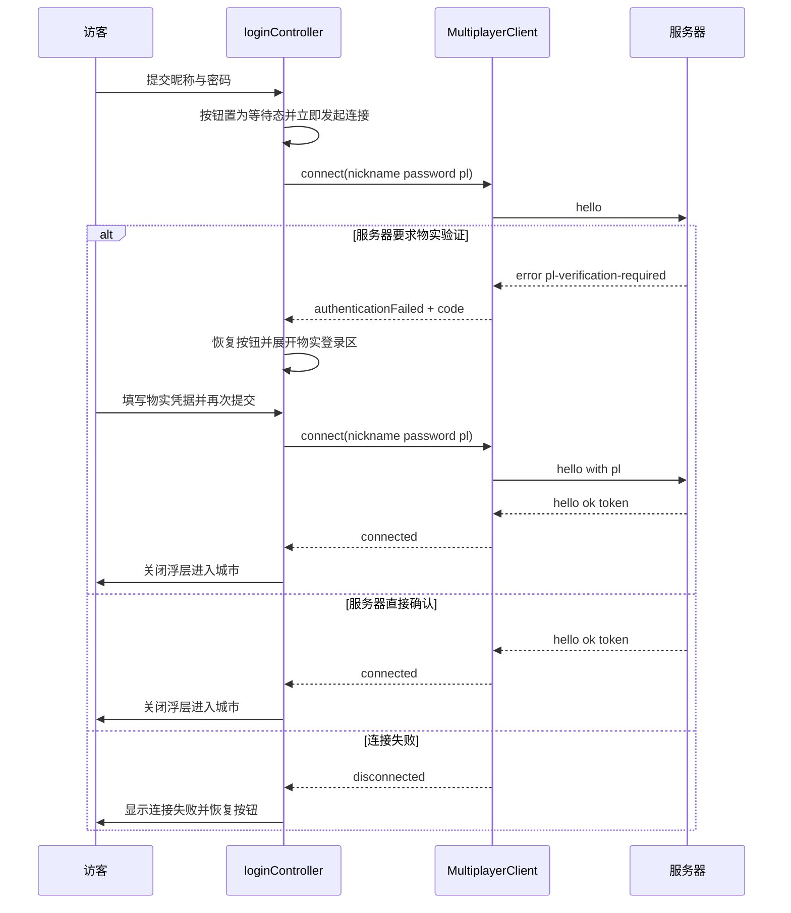
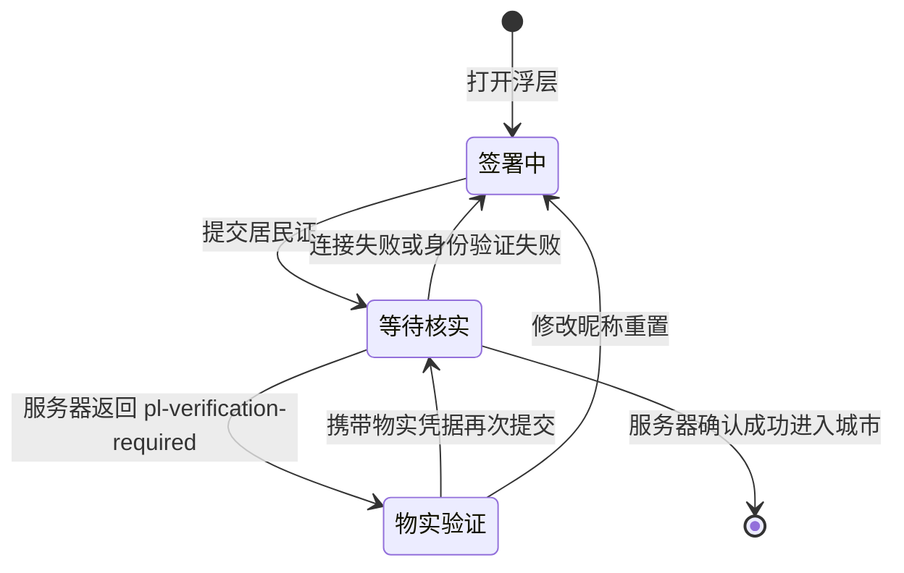

# 物实验证弹出与入城门禁 — 技术设计

Feature Name: pl-verification-popup
Updated: 2026-09-09

## Description

将「入城」动作从居民证提交瞬间推迟到服务器 `hello` 验证通过之后。提交后签署浮层保持可见、按钮进入等待态；服务器要求物实验证时就地展开 `#plVerifySection`；任何失败分支（验证失败、连接失败）都恢复按钮并停留在签署界面；只有 `hello` 成功才关闭浮层进入城市。服务器端逻辑（PR #140 已交付）保持不变。

## Architecture

签署界面的状态机：

## Components and Interfaces

### `apps/web/src/adapters/ui/loginController.ts`

状态机与门禁的唯一属主：

- 新增内部状态：`verifying`（按钮等待态）、`pendingCityEntrance`（被扣住的入城副作用）。
- `beginVerifying()`: 记录 `#loginBtn` 原文案、置为「正在核实身份…」并禁用；`verifying` 期间重复提交直接忽略。
- `endVerifying()`: 恢复按钮文案与可用状态。
- `closeAfterAuth()`: 仅在 `hello` 成功回调中调用——结束等待态、隐藏物实登录区、以现有动画关闭浮层。
- `holdCityEntrance(entrance)`: 由 `proceedToCity` 在 Fresh sign-in 分支调用，扣住入城副作用。
- `asLoginGate()`: 返回 `LoginGate`（`isWaiting` / `onAuthorized` / `onAuthFailed` / `onConnectionLost`），`onAuthorized` 先执行被扣住的入城副作用再 `closeAfterAuth()`；`onConnectionLost` 恢复按钮并显示「暂时无法连接小城服务器，请稍后重试」。
- `login()` 改造：校验通过后 `beginVerifying()` 并立即 `options.proceed(name, password, pl)`；移除「隐藏浮层 + 550ms 延迟」逻辑。`applyUsername` 等现有副作用保持提交时发生（失败路径已有 `showLoginEntry()` 重置）。
- 现有 `collectPlCredentials`、`hidePlVerification`、`validateInput`（修改昵称即重置物实登录区）保持不变。

### `apps/web/src/adapters/ui/multiplayerHousingController.ts`（回调接线）

- 选项新增 `getLoginGate?: () => LoginGate | null`（延迟解析，规避控制器创建顺序）。
- `connection`: 状态为 `disconnected` 且 `gate.isWaiting()` 时，调用 `multiplayer.close()` 终止自动重连并触发 `gate.onConnectionLost()`。令牌恢复路径（非等待态）保持现有自动重连行为。
- `connected`: 先调用 `gate.onAuthorized()`（触发被扣住的入城与浮层关闭），再执行原有的手机 UI / 房屋列表等逻辑。
- `authenticationFailed`: 先调用 `gate.onAuthFailed()`（恢复按钮），再执行现有逻辑（恢复昵称、显示错误、按 `code === 'pl-verification-required'` 展开物实登录区并聚焦、重新打开浮层）。

### `apps/web/src/city/MiniCityApp.ts`

- `proceedToCity` 拆分入城副作用：令牌恢复（无凭据参数）立即执行入城；Fresh sign-in（携带 password/pl）改为 `loginController.holdCityEntrance(entrance)`，由门禁在服务器确认后执行。
- `createMultiplayerHousingController` 选项追加 `getLoginGate: () => loginController?.asLoginGate() ?? null` 一行。
- 其余（`checkLogin`、CG 完成回调、令牌恢复路径）不变。

### `apps/web/src/network/MultiplayerClient.ts`

- 保持不变：`connected` / `authenticationFailed` / `connection` 回调已具备驱动状态机所需的全部信息；`credentials.pl` 在 `hello` 成功后清空（PR #140 已实现）。

### `apps/web/tests/pl-verify-gate.spec.ts`

- e2e 覆盖四个分支：要求验证（展开物实登录区、按钮恢复、浮层保持）、验证后入城（浮层关闭、logo 更新）、免验证直登、连接失败（错误提示 + 按钮恢复 + 浮层保持）。WebSocket 以构造器级 stub 模拟，脚本化响应由 `window.__gateStage` 控制。

## Data Models

无新增数据模型，无数据库迁移。浮层状态仅存在于 `loginController` 内存中。

## Correctness Properties

1. 浮层关闭（入城）仅在 `hello` 成功回调（`connected`）中发生；任何失败分支浮层保持可见。
2. 提交与结果返回之间签署按钮处于禁用等待态；验证失败、连接失败、限流提示每个分支都会调用 `endVerifying()` 恢复按钮。
3. 物实凭据仅随验证分支的 `hello` 发送，验证成功后从客户端内存清除。
4. 修改昵称输入会隐藏物实登录区并清空已填物实凭据（沿用 `validateInput` 现有行为）。
5. 令牌恢复路径与 NPC 编辑页行为保持不变。

## Error Handling

| 场景 | 触发源 | 处理 |
| --- | --- | --- |
| 物实账号密码错误 / 昵称不匹配 | 服务器 error message | `authenticationFailed` 显示原因，物实登录区保持可见，按钮恢复 |
| 小城昵称或密码错误 | 服务器 error message | `authenticationFailed` 显示原因，停留在签署界面 |
| 服务器要求物实验证 | error code `pl-verification-required` | 展开物实登录区并聚焦，按钮恢复 |
| 注册频率限制 / 物实验证限流 | 服务器 error message | `authenticationFailed` 显示原因，按钮恢复 |
| WebSocket 连接失败或超时 | `connection('disconnected')` 且等待态 | 终止自动重连、显示连接失败提示、按钮恢复 |
| 令牌恢复失败 | `authenticationFailed`（恢复路径） | 现有行为：打开签署界面并显示错误 |

## Test Strategy

- Web e2e（新增 `apps/web/tests/pl-verify-gate.spec.ts`），复用 `helpers.ts` 的 `addInitScript` WebSocket stub 模式：
  1. stub `hello` 回 `pl-verification-required` → 断言 `#plVerifySection` 可见、按钮恢复可用。
  2. 修改昵称 → 断言物实登录区隐藏。
  3. 填写物实凭据后 stub 回 `hello` 成功 → 断言浮层关闭进入城市。
  4. stub 连接直接 `close` → 断言连接失败提示出现、按钮可用、浮层保持可见。
- 服务器端无改动，沿用现有 `test:server` 集成测试与 `test:domain`。
- 本地验证：`npm run build` + `npm run test:domain` + `npm run test:server` + `scripts/run-web-tests.sh`（Xvfb 环境）。

## References

[^1]: (Filename#L403) - `apps/web/index.html` 登录浮层与 `#plVerifySection` DOM
[^2]: (Filename#L79) - `apps/web/src/adapters/ui/loginController.ts` 现有 login 提交流程
[^3]: (Filename#L236) - `apps/web/src/adapters/ui/multiplayerHousingController.ts` authenticationFailed 回调
[^4]: (Filename#L109) - `apps/web/src/network/MultiplayerClient.ts` 消息处理与回调
[^5]: (Filename#L56) - `apps/web/tests/helpers.ts` WebSocket stub 模式
