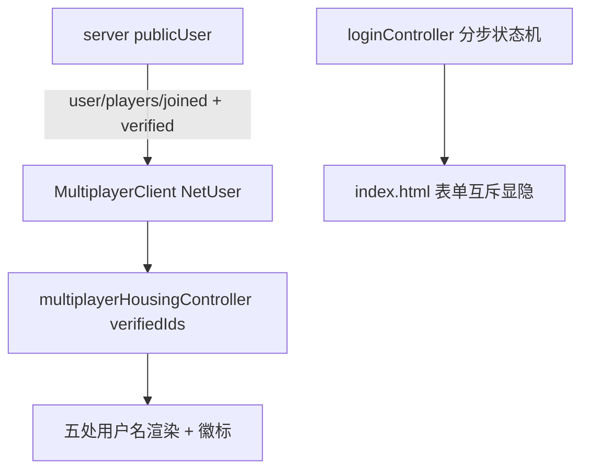

# PL Verify Flow Polish

Feature Name: pl-verify-flow-polish
Updated: 2026-09-10

## Description

两处改进：

1. 签署浮层分步化：`pl-verification-required` 时物实验证表单替代昵称/密码表单展示（互斥显示），提供「换个昵称」返回。
2. 已验证徽标：服务端广播 `verified` 标志，客户端在五处联机用户名位置为已验证居民显示小型对勾徽章。

## Architecture

服务端单点改动：`publicUser`（apps/server/src/index.ts:66）输出 `verified: user.plUserId != null`，hello 的 user/players 与 `player.joined` 广播均复用该函数。

前端状态流：`NetUser.verified?: boolean` 可选字段 → `multiplayerHousingController` 维护 `verifiedIds: Set<string>`（connected 重建、joined 增、left 删）→ 各渲染点通过 helper 附加徽标。

## Components and Interfaces

### server/index.ts

- `publicUser(user: User): PublicUser` 增加 `verified` 布尔字段（`user.plUserId != null`）。`PublicUser` 类型同步扩展。

### apps/web/src/network/MultiplayerClient.ts

- `NetUser` 增加 `verified?: boolean`（可选，旧服务端兼容）。

### apps/web/src/adapters/ui/loginController.ts（分步状态机）

- 新增模块级状态 `verifyStep: boolean`。
- `showPlVerification()`：显示 `#plVerifySection`，隐藏 `#loginInput`、`#loginPassword`、`.login-warning`、标题副标题（按 class `login-credentials` 分组显隐），显示返回按钮，提交按钮文案改为「确认物实身份」。
- `hidePlVerification()`：恢复上述元素显隐，清空 `#plLoginInput`/`#plPasswordInput`，隐藏验证区，恢复默认按钮文案。
- 新增返回按钮处理：点击 → `hidePlVerification()` + 聚焦昵称输入框。
- `beginVerifying()`/`endVerifying()` 的按钮文案依据 `verifyStep` 选择（「正在核实身份…」不变；结束时按步骤恢复）。
- `applyUsername(name)` 增加可选 `verified` 参数：设置 banner 登录名并按需附加徽标。

### apps/web/src/adapters/ui/multiplayerHousingController.ts（验证集合 + 渲染点）

- `verifiedIds: Set<string>`：connected 时以 `user.id`（verified 时）+ `players` 重建；`playerJoined` 按 `verified` 增删；`playerLeft` 删除。
- 渲染点改造（共用 helper `withVerifiedBadge(nickname, verified): HTMLElement`——span 包裹昵称文本 + 可选 `✓`）：
  1. `phoneOwner`（本人，connected 回调内）
  2. `appendChat`：增加 `verified` 参数（按 `message.userId` 查集合）
  3. 房屋成员 chip（`member.userId` 查集合）
  4. 在线人员 `hc-person-name`（player 对象直接带 `verified`）
  5. banner `logoUser`（经 `applyUsername`）

### apps/web/index.html + CSS

- `#plVerifySection` 内新增「换个昵称」按钮（`#plVerifyBack`）。
- 昵称/密码输入与警示文案包一层分组（class 标记或直接按 id 列表显隐，避免大改 DOM）。
- `.verified-badge` 样式：inline-flex、小号、主题绿、不换行、与昵称基线对齐。

## Data Models

- `PublicUser = { id, nickname, position, verified: boolean }`
- `NetUser = { id, nickname, position, verified?: boolean }`
- 前端派生态：`verifiedIds: Set<string>`

## Correctness Properties

- `verified` 与 `plUserId` 一一对应：`publicUser(u).verified === (u.plUserId != null)`。
- `verifiedIds` 与在线居民集合一致：connected 重建后覆盖全部在线已验证居民；left 后不残留。
- 验证步骤中昵称/密码输入框的值保留（服务端要求 nickname+password+pl 同时提交），分步仅是视觉显隐。
- 旧服务端（无 verified 字段）下前端集合恒空，徽标不渲染，行为与现状一致。

## Error Handling

- 物实验证失败：留在验证步骤（`onAuthFailed` → `endVerifying()`，按钮恢复「确认物实身份」），错误写入现有 `#loginError`。
- 连接失败：沿用现有 `onConnectionLost`（错误提示 + 恢复按钮），并保持在当前步骤。
- 「换个昵称」返回：清空物实输入，恢复昵称表单，焦点回到昵称输入框。

## Test Strategy

- 更新 `apps/web/tests/pl-verify-gate.spec.ts`：
  - 验证步骤出现时断言昵称/密码输入隐藏、验证区可见、按钮文案为「确认物实身份」。
  - 「换个昵称」返回：断言恢复表单、物实输入清空。
  - 既有等待态/直登/断线用例保持通过。
- 新增徽标用例（扩展 pl-verify-gate 或 smoke 辅助 stub）：hello 带 `verified: true` 的玩家 → 断言聊天作者名旁出现 `.verified-badge`；未 verified 玩家无徽标。
- 服务端：`publicUser` 为纯函数，随 CI 构建类型检查覆盖。
- 远端 GitHub Actions 全量验证，本地跑构建与尺寸检查（MiniCityApp.ts 不改动）。

## References

[^1]: apps/server/src/index.ts#L66 — publicUser 定义
[^2]: apps/server/src/auth.ts#L88 — plUserId 仅注册时绑定
[^3]: apps/web/index.html#L412 — plVerifySection 结构
[^4]: apps/web/src/adapters/ui/loginController.ts — 签署浮层状态机
[^5]: apps/web/src/adapters/ui/multiplayerHousingController.ts — 联机回调与渲染点
