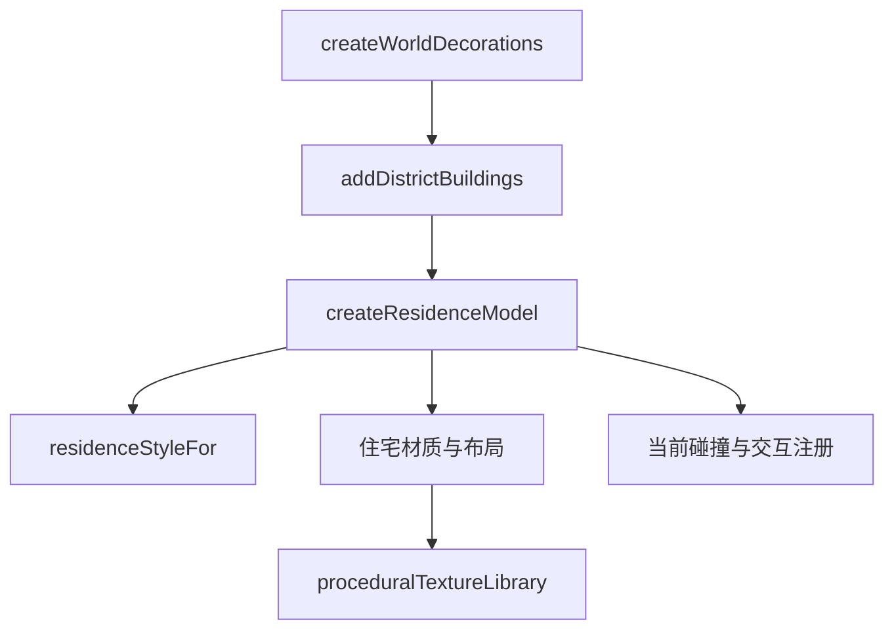

# 居民楼视觉变体

Feature Name: residence-visual-variants
Updated: 2026-08-16

## Description

本方案将居民楼的视觉生成集中在 `residenceStyles.ts`，并在 `proceduralTextureLibrary.ts` 增加可缓存的住宅墙面贴图。居民楼布局、地块、交互标记、障碍物和新增建筑继续由现有场景装饰流程负责。

## Architecture

## Components and Interfaces

- `residenceStyleFor(x, z, index)`：根据街区坐标和索引确定性选择视觉变体。
- `createResidenceModel(options)`：生成当前尺寸与占地约束下的居民楼视觉模型。
- `createProceduralTextureLibrary(...).initialize()`：初始化并缓存住宅墙面与屋顶贴图。
- `worldDecorations.ts`：继续负责坐标、数量、旋转、地块、射线拾取和障碍物注册。

## Correctness Properties

- 居民楼世界坐标来自当前 `addSmallBlock` 调用参数。
- 居民楼的 `residenceId`、`residenceStyleId` 和 `navigationFootprint` 继续存在。
- 样式选择仅依赖确定性输入，刷新场景后保持一致。
- 住宅贴图通过资源池复用。

## Test Strategy

- TypeScript 类型检查和 Vite 构建。
- 静态检查确认 `worldDecorations.ts` 的布局与障碍物注册路径未改变。
- 浏览器预览确认住宅颜色、屋顶、窗户和附属布局存在多样性。
